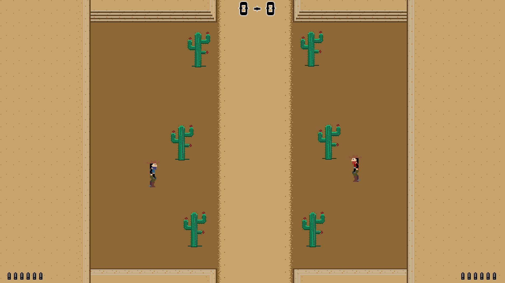

# Western Classic Shoot Out

**Game is not in a final state yet**\

This is an indie game made in Godot. Pixel art Graphics and code is done by me.
It is an homage to the old game from C64 "The Duel". 

Simple gameplay, shoot the other player. If you hit in the body, you slow him down. If you hit him in the head, you get a point.
First to 5 wins.

### Player 1 Controls:
UP - W\
DOWN - S\
LEFT - A\
RIGHT - D\
SHOOT - 1\
RELOAD - ½\

### Player 2 Controls:
UP - UP-Arrow Key\
DOWN - DOWN-Arrow Key\
LEFT - LEFT-Arrow Key\
RIGHT - RIGHT-Arrow Key\
SHOOT - Å\
RELOAD - ^\

